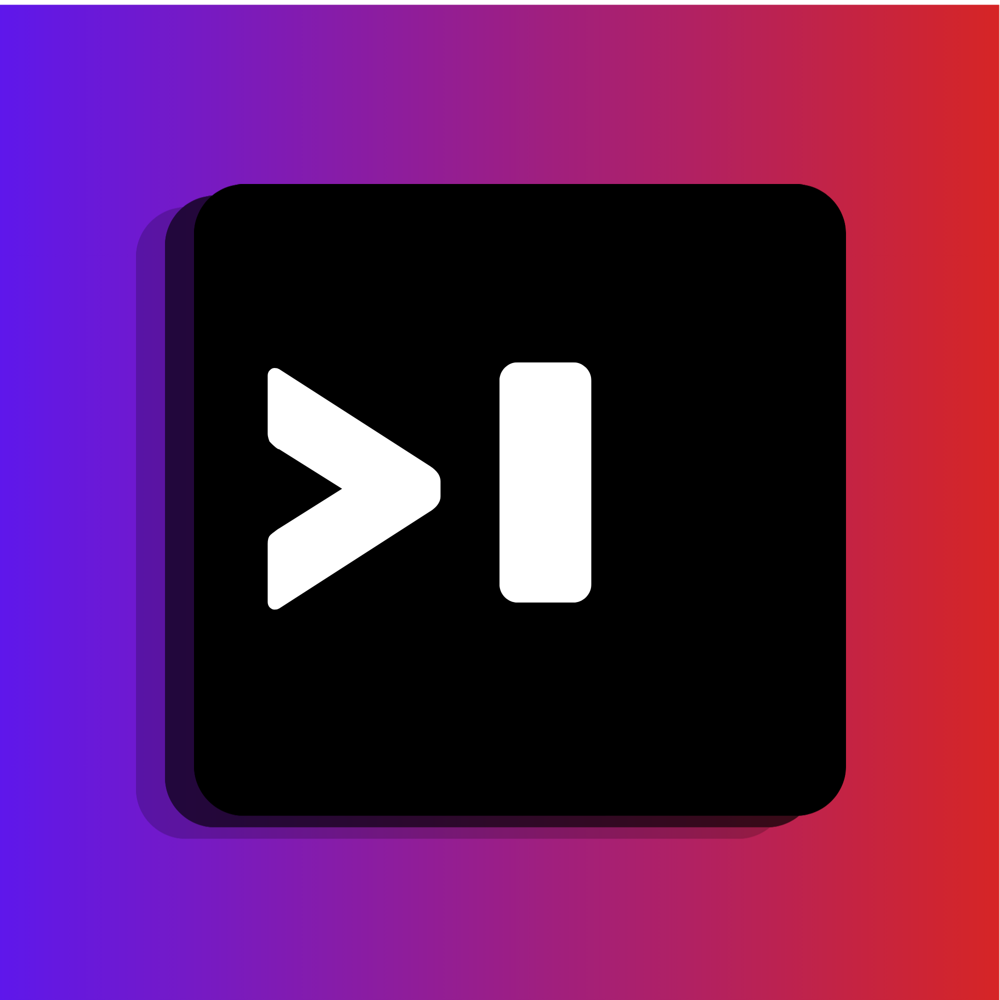

# El Terminalo

A modern, GPU-accelerated terminal emulator for macOS.



## Install

Download the latest `.dmg` from [Releases](https://github.com/albinantoab/ElTerminalo/releases/latest), open it, and drag **El Terminalo** to your Applications folder.

## Features

- **Tabbed interface** — Up to 9 tabs with Cmd+1-9 switching
- **Split panes** — Vertical and horizontal splits with draggable dividers
- **Command palette** — Quick access to all commands via Cmd+P
- **Custom commands** — Save frequently used commands globally or per-project
- **Themes** — Built-in themes + create your own via the palette
- **State persistence** — Tabs, splits, and working directories restored on restart
- **GPU-accelerated rendering** — WebGL-powered terminal via xterm.js
- **Native macOS look** — Transparent titlebar, proper window management

## Demos

### AI Assistant
<video src="assets/videos/ai.mp4" width="100%" autoplay loop muted playsinline></video>

### JSON Viewer
<video src="assets/videos/json.mp4" width="100%" autoplay loop muted playsinline></video>

### Table View
<video src="assets/videos/table.mp4" width="100%" autoplay loop muted playsinline></video>

### Custom Shortcuts
<video src="assets/videos/shortcuts.mp4" width="100%" autoplay loop muted playsinline></video>

### Status Modal
<video src="assets/videos/status-modal.mp4" width="100%" autoplay loop muted playsinline></video>

## Keyboard Shortcuts

| Shortcut | Action |
|----------|--------|
| `Cmd + P` | Command palette |
| `Cmd + T` | New tab |
| `Cmd + W` | Close tab |
| `Cmd + 1-9` | Switch to tab |
| `Cmd + B` | Split vertical |
| `Cmd + G` | Split horizontal |
| `Cmd + X` | Close pane |
| `Cmd + Arrow` | Navigate between panes |
| `Cmd + L` | Clear terminal |
| `Cmd + Shift + C` | Create custom command |

## Custom Commands

Commands can be saved globally (`~/.config/elterminalo/commands.json`) or per-project (`.elterminalo/commands.json` in your project directory).

Create commands via the palette (`Cmd + Shift + C`) or edit the JSON files directly:

```json
{
  "commands": [
    {
      "name": "Build",
      "command": "npm run build",
      "description": "Build for production",
      "shortcut": "Cmd+Shift+B"
    }
  ]
}
```

In the command palette, use `Cmd + E` to edit or `Cmd + D` to delete a selected command.

## Themes

El Terminalo ships with 4 built-in themes: **Terminalo**, **Noctis**, **Ember**, and **Aurora**.

Create your own theme via the command palette ("Create Theme") or edit existing ones with `Cmd + E`. Custom themes are saved to `~/.config/elterminalo/themes.json`.

## Building from Source

<details>
<summary>For contributors and developers</summary>

### Prerequisites

- Go 1.24+
- Node.js 18+
- [Wails v2](https://wails.io/) CLI

### Setup

```bash
# Install Wails CLI
go install github.com/wailsapp/wails/v2/cmd/wails@latest

# Install frontend dependencies
cd frontend && npm install && cd ..

# Run in development mode (hot reload)
wails dev

# Build production binary
wails build
```

See [CONTRIBUTING.md](CONTRIBUTING.md) for development guidelines.

</details>

## License

[MIT](LICENSE)
