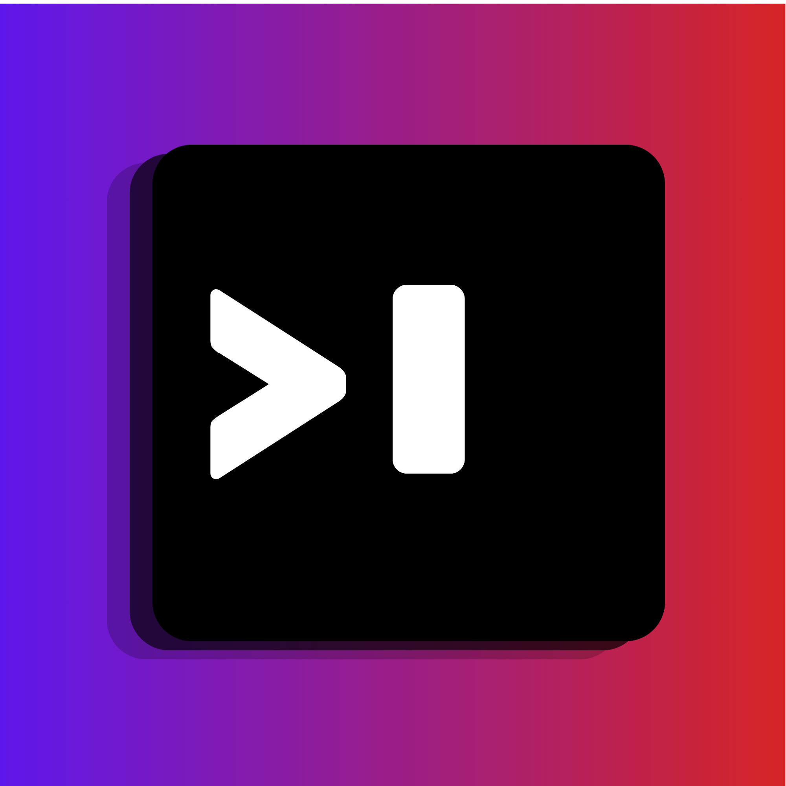

# El Terminalo

A modern, GPU-accelerated terminal emulator for macOS.



## Install

Download the latest `.dmg` from [Releases](https://github.com/albinantoab/ElTerminalo/releases/latest), open it, and drag **El Terminalo** to your Applications folder.

**Requires macOS 12 Monterey or later**, on Apple silicon. That is the floor the Go toolchain the app is built with sets — the binary declares it in its Mach-O header, so an older system refuses to load it rather than failing in some interesting way later.

## Features

- **Tabbed interface** — Up to 9 tabs with Cmd+1-9 switching
- **Split panes** — Vertical and horizontal splits with draggable dividers
- **Command palette** — Quick access to all commands via Cmd+P
- **Custom commands** — Save frequently used commands globally or per-project
- **Themes** — Built-in themes + create your own via the palette
- **State persistence** — Tabs, splits, and working directories restored on restart
- **Notifications** — A native banner and a Dock badge when a pane finishes while you are elsewhere
- **Transcripts** — Record everything a pane prints to a file
- **Workspaces** — Save a named layout and reopen it later
- **GPU-accelerated rendering** — WebGL-powered terminal via xterm.js
- **Native macOS look** — Transparent titlebar, proper window management

## Demos

### AI Assistant
https://github.com/user-attachments/assets/e657f481-2b18-42e9-a978-a57fe2bd120c

### JSON Viewer
https://github.com/user-attachments/assets/3b7b4f84-1efa-46d7-b6dc-9716ecd186dd

### Table View
https://github.com/user-attachments/assets/3535f539-9767-4935-ab8a-d3f9117e63e5

### Custom Shortcuts
https://github.com/user-attachments/assets/0b5a8134-3b50-4bf2-95ed-6ceff2162413

### Status Modal
https://github.com/user-attachments/assets/91a65c8d-0ce1-4052-980d-c3a78a00c360

## Keyboard Shortcuts

The menu bar lists these too — every item there does exactly what its shortcut does.

| Shortcut | Action |
|----------|--------|
| `Cmd + P` | Command palette |
| `Cmd + ,` | Open settings |
| `Cmd + T` | New tab |
| `Cmd + W` | Close tab |
| `Cmd + 1-9` | Switch to tab |
| `Cmd + Shift + ]` / `[` | Next / previous tab |
| `Cmd + D` | Split vertically |
| `Cmd + Shift + D` | Split horizontally |
| `Cmd + Shift + X` | Close pane |
| `Cmd + Arrow` | Navigate between panes |
| `Cmd + Shift + Return` | Zoom the active pane (fill the tab / restore) |
| `Cmd + Shift + A` | Jump to the next pane needing attention |
| `Cmd + F` | Find in scrollback |
| `Cmd + L` | Clear terminal |
| `Cmd + I` | Session status |
| `Cmd + Shift + R` | Search command history |
| `Cmd + Shift + O` | Reveal the pane's folder in Finder |
| `Cmd + =` / `-` / `0` | Zoom in / out / actual size |
| `Cmd + Shift + C` | Create custom command |
| `Ctrl + Cmd + F` | Toggle full screen |

**File › Save Workspace…**, **File › Open Workspace…** and **File › Record Transcript** have no shortcut — they are deliberate, occasional actions, and the first two open a prompt rather than doing anything on their own.

## Configuration

Settings live in `~/.config/elterminalo/config.json`. Open it with **Cmd + ,** (File › Settings…, or Help › Open Settings File) — the file is created with the defaults the first time you open it, and never rewritten after that.

Once you have saved your edits, run **Reload Settings** from the command palette (`Cmd + P`) to apply them without restarting. A changed `shell` applies to panes opened from then on; existing panes keep the shell they started with.

Shell integration — command blocks, the exit-status and duration badges, history recording, and working-directory tracking via OSC 7 — is installed for **zsh and bash only**. Any executable shell works as a `shell`, but one that is neither (fish, `/bin/sh`, nushell) runs as a plain terminal without those features.

```json
{
  "fontFamily": "'MonaspiceNe NFM', 'SF Mono', 'Menlo', monospace",
  "fontSize": 12,
  "lineHeight": 1.2,
  "cursorStyle": "block",
  "cursorBlink": true,
  "scrollback": 10000,
  "shell": "",
  "optionIsMeta": true,
  "bell": "sound",
  "copyOnSelect": true,
  "confirmQuit": "running"
}
```

| Key | Type | Default | Values |
|-----|------|---------|--------|
| `fontFamily` | string | `'MonaspiceNe NFM', 'SF Mono', 'Menlo', monospace` | Any CSS font stack. Keep a `monospace` fallback at the end. |
| `fontSize` | number | `12` | 6–72 (integer; fractional values are rounded) |
| `lineHeight` | number | `1.2` | 1.0–2.0, as a multiple of the font size |
| `cursorStyle` | string | `"block"` | `"block"`, `"underline"`, `"bar"` |
| `cursorBlink` | boolean | `true` | |
| `scrollback` | integer | `10000` | 0–1000000 lines kept per pane |
| `shell` | string | `""` | `""` uses `$SHELL` (or `/bin/zsh`). Otherwise an **absolute path** to an executable — e.g. `"/opt/homebrew/bin/fish"`. A change applies to panes opened from then on. Shell integration is installed for zsh and bash only; anything else loses command blocks, badges, history recording and OSC 7 directory tracking. |
| `optionIsMeta` | boolean | `true` | `true` sends Option-key presses to the shell as Meta; `false` lets macOS compose characters (`Option+n` → `~`). |
| `bell` | string | `"sound"` | `"none"`, `"sound"`, `"visual"`, `"both"` |
| `copyOnSelect` | boolean | `true` | Copy a selection to the clipboard as soon as it is made. |
| `confirmQuit` | string | `"running"` | `"running"` asks only when commands are still running, `"always"` always asks, `"never"` quits immediately. |

Anything the app cannot use is repaired in memory and reported in the log — a number outside its range is clamped, an unrecognised value falls back to the default, and a file that does not parse at all leaves every setting at its default. **Your file is never rewritten**, so a typo is always still there to fix.

Unknown keys are ignored, which makes them a convenient place to leave yourself a note.

### Logs

`~/.config/elterminalo/logs/elterminalo.log`, with two rotated generations beside it. **Help › Reveal Logs** opens the folder in Finder. This is where a rejected setting, a shell that could not be launched, or a colour scheme that failed to import explains itself.

### Importing a colour scheme

**File › Import Color Scheme…** reads two formats and converts either into a theme:

- **iTerm2** `.itermcolors` files (the XML property lists from [iterm2colorschemes.com](https://iterm2colorschemes.com))
- **Ghostty** theme files (`key = value` lines: `palette = 0=#1d1f21`, `background`, `foreground`, `cursor-color`, `selection-background`, …)

The theme is named after the file and saved to `~/.config/elterminalo/themes.json`, replacing any theme of the same name. The 16 ANSI colours, background, foreground, cursor and selection come straight from the file; the app's own accent, borders and status bar are derived from them (the accent is the scheme's blue).

## Notifications

El Terminalo can post a native macOS banner when something finishes in a pane you are not looking at. Two things ask for one:

- **The shell's bell** — the `BEL` byte (`\a`), which is what a shell prints when a command completes in a pane that is not focused, and what `printf '\a'` sends by hand.
- **`OSC 9` and `OSC 777`** — the escape sequences programs use to raise a desktop notification directly:

  ```bash
  printf '\033]9;Build finished\007'                     # OSC 9: body only
  printf '\033]777;notify;Build finished;exit 0\007'      # OSC 777: title and body
  ```

Clicking the banner brings the window forward and focuses the pane the notification came from, whichever tab it is in.

**macOS asks for permission the first time**, with the usual "El Terminalo would like to send you notifications" alert. Answer it once and the answer is remembered for good — the app never asks again. To change your mind later, go to **System Settings › Notifications › El Terminalo**. If notifications are off, the app falls back to the in-window attention markers described below and says so in the log; nothing is silently dropped.

Notifications need the packaged app. A binary run straight from `wails build`'s output or from `wails dev` has no bundle identifier, so macOS has nothing to attribute a notification to and the feature turns itself off.

### The Dock badge

While the app is in the background, the number of panes waiting for you appears as a badge on the Dock icon, and clears as you visit them. It needs no permission and is always on.

Separately, a bell in a background window bounces the Dock icon once and leaves the tile marked — that is the `bell` setting, not this.

## Panes

**Cmd + Shift + Return** zooms the active pane so it fills its tab, and again to put the split back. Nothing is closed or restarted; the other panes keep running behind it.

**Cmd + Shift + A** jumps to the next pane needing attention — one whose command finished, or whose bell rang, while you were somewhere else. It walks across tabs, so it is the fastest way to work through what happened while you were away.

**Cmd + Shift + O** (File › Reveal Folder in Finder) opens the active pane's working directory in Finder, with it selected.

**Open Folder in Editor** (command palette) hands the same directory to an editor instead. It picks the first of these that it can find:

1. `$VISUAL`, then `$EDITOR` — but only when the value names a macOS application. A terminal editor (`vim`, `nano`, a path to `nvim`) is skipped, because `open -a vim` is not something macOS can do; `code` is skipped too and lands on Visual Studio Code at the next step, which is where its user meant it to go. Flags are ignored (`code -w` resolves as `code`), and a full path to a bundle works for an editor installed somewhere unusual (`/Users/you/Dev/Zed.app`).
2. **Visual Studio Code**, if it is installed.
3. **TextEdit**, but only for a file — it cannot open a folder.
4. Otherwise the folder goes to the system default, which is Finder.

Applications are looked for in `~/Applications`, `/Applications`, `/Applications/Utilities` and the two `/System/Applications` directories. Note that a GUI app inherits launchd's environment rather than a login shell's, so `$VISUAL` and `$EDITOR` set in `~/.zshrc` are **not** visible here; to have them honoured, set them for the GUI session — `launchctl setenv VISUAL "/Applications/Zed.app"` — or launch El Terminalo from a shell.

## Transcripts

**File › Record Transcript** starts writing everything the active pane prints to a file, and the same item stops it.

A recording ends in one of four ways, and the pane is told about all of them:

- you stop it,
- the pane closes,
- the file reaches **256 MiB**, or
- a write to it fails — a full disk, a volume that went away.

The last two are the ones worth knowing about. A recording left running overnight must not be able to fill your disk, so it stops itself at the cap; a recording whose disk fails is abandoned rather than allowed to stall the pane, because a broken transcript is not a broken pane and your shell keeps running either way. In both cases the file is closed off cleanly, the recording indicator goes out, and the pane says which file it stopped and why — a transcript never quietly stops growing while the app still claims to be recording. The cap is crossed by at most one read (64 KiB), so the file is a little over 256 MiB, not exactly.

Transcripts are written to:

```
~/.config/elterminalo/transcripts/<yyyy-mm-dd>/<HHMMSS>-<session>.log
```

— one folder per day, and one file per recording, named after the time it started and the first eight characters of the pane's session id. The folder and the files are owner-only (`0700` / `0600`): a transcript holds everything a pane printed, which is your commands, their output, and the paths you were working in.

**A transcript is the raw stream, not a cleaned-up log.** Colour codes, cursor movement, progress-bar redraws and every other escape sequence are recorded exactly as the program emitted them — that is the point, since a stripped file would no longer be a record of what the pane actually did. To read one back the way it looked:

```bash
# Replay it exactly as it looked, colours and all
cat ~/.config/elterminalo/transcripts/2026-08-30/142530-9f1c2b3a.log

# Page through it with the colours kept
less -R ~/.config/elterminalo/transcripts/2026-08-30/142530-9f1c2b3a.log

# Strip the escape sequences so it can be grepped
sed $'s/\033\[[0-9;?]*[a-zA-Z]//g' <file> > plain.txt
```

## Workspaces

A workspace is a named snapshot of your layout — every tab, every split, and each pane's working directory. It is the same thing the app restores on restart, except that you choose when to take it and nothing overwrites it afterwards.

- **File › Save Workspace…** asks for a name and stores the current layout under it. Saving again under the same name replaces it.
- **File › Open Workspace…** lists what you have saved, with the date and the tab and pane counts, and rebuilds the one you pick.

They live in `~/.config/elterminalo/workspaces/`, one owner-only `.json` file per workspace, named after a slug of the name you gave it (`My Project` → `my-project.json`). The name you typed is kept inside the file, so it is the name you see in the list — two different names that reduce to the same slug are stored side by side (`my-project.json`, `my-project-2.json`) rather than one replacing the other. Deleting a workspace from the picker removes its file; nothing else in the directory is touched, so a file you drop in there by hand is listed too.

## Custom Commands

Commands can be saved globally (`~/.config/elterminalo/commands.json`) or per-project (`.elterminalo/commands.json` in your project directory).

Create commands via the palette (`Cmd + Shift + C`) or edit the JSON files directly:

```json
{
  "commands": [
    {
      "name": "Build",
      "command": "npm run build",
      "description": "Build for production",
      "shortcut": "Cmd+Shift+B"
    }
  ]
}
```

In the command palette, use `Cmd + E` to edit or `Cmd + D` to delete a selected command.

## Themes

El Terminalo ships with 4 built-in themes: **Terminalo**, **Noctis**, **Ember**, and **Aurora**.

Create your own theme via the command palette ("Create Theme") or edit existing ones with `Cmd + E`. Custom themes are saved to `~/.config/elterminalo/themes.json`. You can also import an iTerm2 or Ghostty colour scheme — see [Importing a colour scheme](#importing-a-colour-scheme).

## Building from Source

<details>
<summary>For contributors and developers</summary>

### Prerequisites

- Go 1.25+ (the version `go.mod` names; it is also what sets the macOS 12 floor above)
- Node.js 18+
- [Wails v2](https://wails.io/) CLI

### Setup

```bash
# Install Wails CLI
go install github.com/wailsapp/wails/v2/cmd/wails@latest

# Install frontend dependencies
cd frontend && npm install && cd ..

# Run in development mode (hot reload)
wails dev

# Build production binary
wails build
```

See [CONTRIBUTING.md](CONTRIBUTING.md) for development guidelines.

</details>

## License

[MIT](LICENSE)
